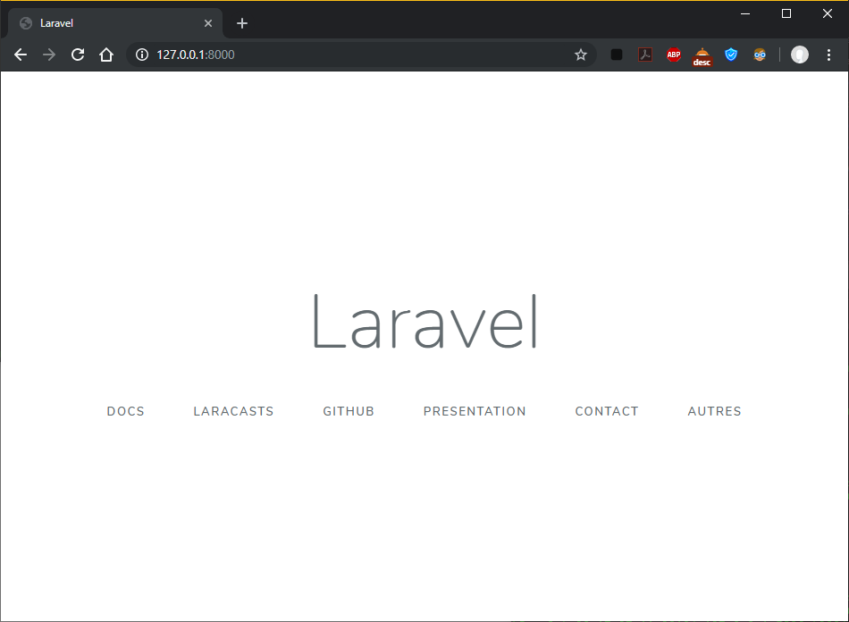
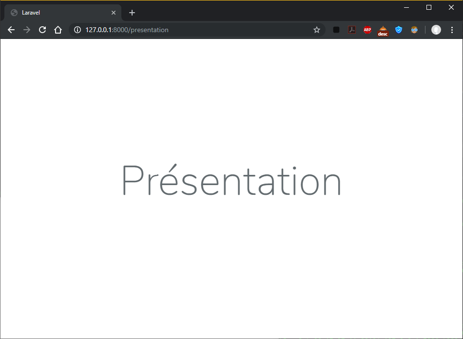
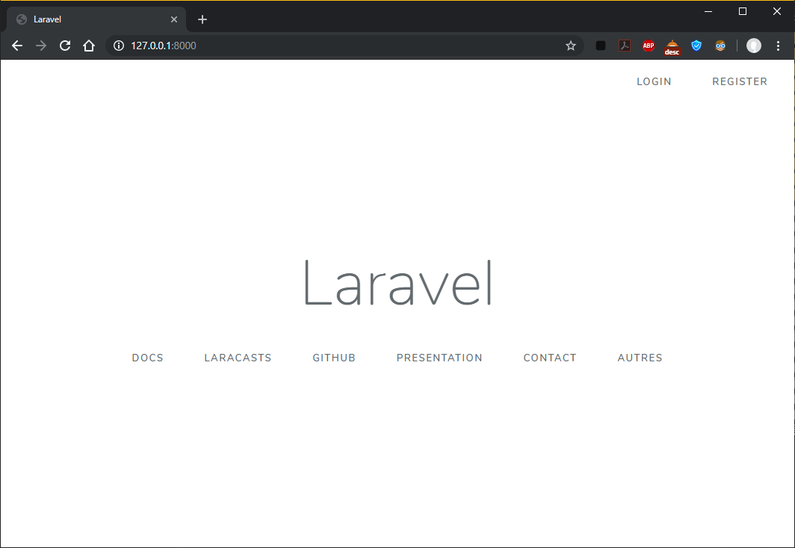
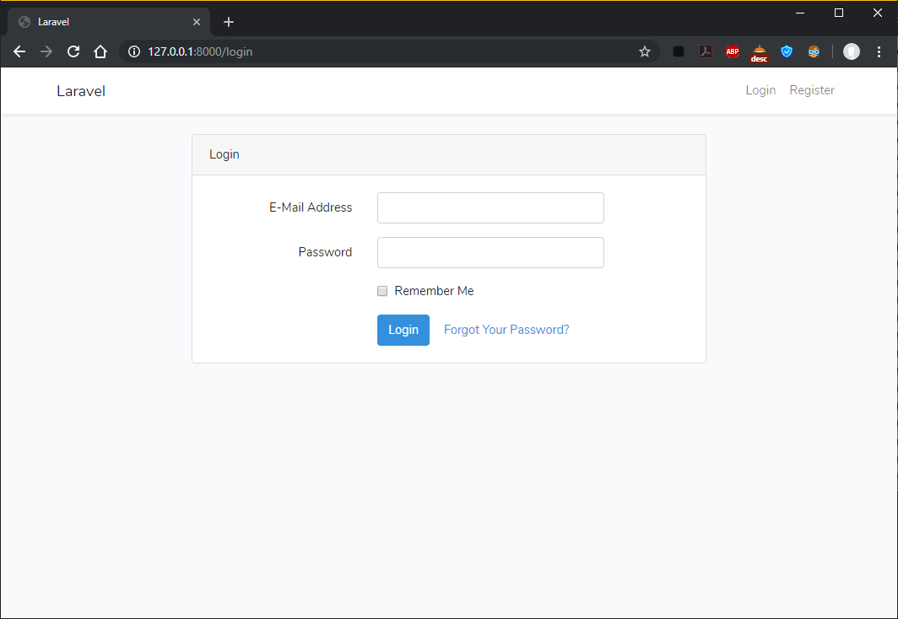
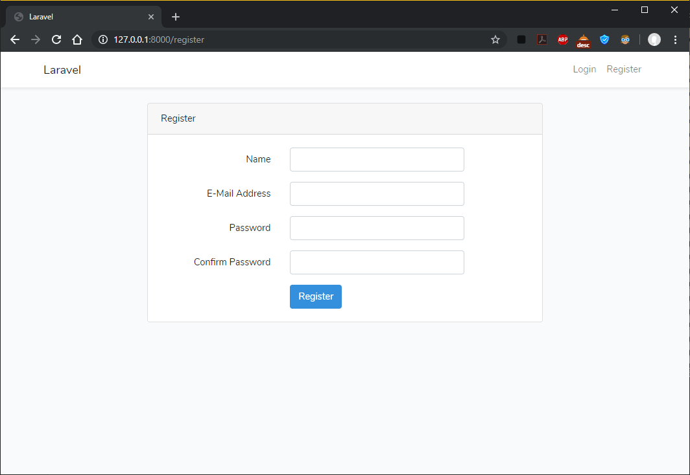

# Projet Laravel

---

- [Séance 1](http://127.0.0.1:8000/docs/{{version}}/overview#section-1)
  - [Étape 1](http://127.0.0.1:8000/docs/{{version}}/overview#etape-1)
  - [Étape 2](http://127.0.0.1:8000/docs/{{version}}/overview#etape-2)
  - [Étape 3](http://127.0.0.1:8000/docs/{{version}}/overview#etape-3)

- [Séance 2](http://127.0.0.1:8000/docs/{{version}}/overview#section-2)

- [Séance 3](http://127.0.0.1:8000/docs/{{version}}/overview#section-3)

<a name="section-1"></a>

## Séance 1 : Installation de l'environnement de développement et création du premier projet

<a name="etape-1"></a>

### Étape 1 : Installation de l'environnement de développement

- #### Installer ou avoir un IDE :

Pour se faire il suffit de se rendre sur le site de l'IDE que l'on souhaite et suivre les étapes d'installations qui diffèrent pour chacun des OS.

- #### Installer ou avoir PHP7

Afin de pouvoir utiliser PHP7, on télécharge la version qui nous intéresse sur le site officiel de PHP (`https://www.php.net/downloads.php`) ou en cliquant [ici](https://www.php.net/downloads.php). Ensuite, on le décompresse dans le dossier désiré puis on ajoute le chemin de ce dossier aux variables de `path` afin de pouvoir utiliser la commande `php` partout sur notre machine.

- #### Installer ou avoir composer

Pour installer composer, il suffit de suivre les étapes décrites sur le site officiel de ce dernier (`https://getcomposer.org/download/`) ou en cliquant [ici](https://getcomposer.org/download/). Une fois installé, bien vérifier une fois de plus la présence de son dossier dans le `path` afin de pouvoir utiliser la commande `composer` partout sur notre machine.

- #### Installer ou avoir un serveur web

Afin d'héberger notre site (en local) nous utiliserons Uwamp. Une fois de plus, pas trop de difficulté pour l'installer via le site officiel disponible [ici](https://www.uwamp.com/fr/?page=download) (`https://www.uwamp.com/fr/?page=download`). Bien choisir la version de PHP que Uwamp utilisera, et aussi installer mysql (via l'installer).

- #### Installer ou avoir une base de données

Comme précédemment fait avec Uwamp, `MySQL` sera installé, et avec Apache (aussi installé) nous pourrons accèder à notre base de données en ligne en cliquant sur le boutton `PHPMyAdmin` sur la fenêtre Uwamp une fois le serveur lancé. Il est conseillé de s'y rendre une première fois afin de créer une base de données (petit boutton `Nouvelle bas de données` en haut de la liste sur la gauche) que nous utiliserons plus tard.

<a name="etape-2"></a>

### Étape 2 : Créer son premier projet

- #### Créer un projet Laravel

Pour créer notre premier projet, il suffira d'aller dans le dossier de votre convenance et de lancer la commande `composer create-project --prefer-dist laravel/laravel nom-du-projet 6.0.*`.

- #### Connecter la Base de données

Afin de connecter la base de données (gérée par Uwamp) à notre projet, il suffit de se rendre dans le fichier `.env` dans le dossier du projet, et d'éditer la partie DB, à savoir ceci :

```text
DB_CONNECTION=mysql
DB_HOST=127.0.0.1
DB_PORT=3306
DB_DATABASE=laravel
DB_USERNAME=root
DB_PASSWORD=
```

Et normalement, dans notre cas, les deux seuls "champs" qui seront modifiés seront `DB_DATABASE` et `DB_PASSWORD` dans lesquels vous aurez respectivement besoin d'indiquer le nom de la base de donné à utiliser (oui oui celle créée dans la partie précédente) et le mot de passe de PHPMyAdmin.

- #### Avoir un premier rendu visuel

Pour avoir le premier rendu, il suffira de lancer le serveur intégré à Laravel via la commande `php artisan serve` qui nous retourne, normalement, l'adresse via laquelle on peut accèder à notre site (en local) comme ceci :

```text
C:\Users\User\Desktop\laravel\blog>php artisan serve
Laravel development server started: <http://127.0.0.1:8000>
```

Et une fois dessus, on obtient ceci :


<a name="etape-3"></a>

### Étape 3 : Lire et comprendre

- #### Créer les premières pages

Pour créer une page accessible depuis notre site Laravel, on créée tout d'abord les vues `presentation`, `contact` et `autres` dans le dossier `resources/views/` que l'on nommera `presentation.blade.php`, `contact.blade.php` et `autres.blade.php`. Si l'on se limite à ca, les vues seront créées mais innacessible. Pour changer ceci, on leur créée à chacune une route dans le fichier `routes/web.php` avec comme "forme" ceci :

```php
Route::get('/view', function () {
    return view('viewName');
});
```

Ce qui, dans notre exemple donnerait :

```php
Route::get('presentation', function () {
    return view('presentation');
});

Route::get('contact', function () {
    return view('contact');
});

Route::get('autres', function () {
    return view('autres');
});
```

Maintenant, on peut accèder aux pages présentation, contact et autres en utilisant l'URL, mais comment faire pour par exemple y accèder depuis la page d'accueil ? Rien de plus simple ! Il suffit dans ce cas de modifier le fichier d'accueil (à savoir `resources/views/welcome.blade.php`) et dans le body d'ajouter des liens vers ces nouvelles pages :

```html
<a href="{{url('presentation')}}">Presentation</a>
<a href="{{url('contact')}}">Contact</a>
<a href="{{url('autres')}}">Autres</a>
```

Qui nous donne finalement sur la page d'accueil :



Et par exemple si on clique sur la page `Présentation` :



### Exercice 2 : Ajouter un système d'authentification

Pour ajouter un système d'authentification à notre site, rien de plus simple. Il suffit, dans le dossier de votre site, de lancer la commande `composer require-dev laravel/ui --dev` :

```text
C:\Users\User\Desktop\laravel\blog>composer require laravel/ui --dev
Using version ^1.1 for laravel/ui
./composer.json has been updated
Loading composer repositories with package information
Updating dependencies (including require-dev)
Package operations: 1 install, 0 updates, 0 removals
  - Installing laravel/ui (v1.1.1): Downloading (100%)
Writing lock file
Generating optimized autoload files
> Illuminate\Foundation\ComposerScripts::postAutoloadDump
> @php artisan package:discover --ansi
Discovered Package: facade/ignition
Discovered Package: fideloper/proxy
Discovered Package: laravel/tinker
Discovered Package: laravel/ui
Discovered Package: nesbot/carbon
Discovered Package: nunomaduro/collision
Package manifest generated successfully.
```

Puis la commande `php artisan ui vue --auth` :

```text
C:\Users\User\Desktop\laravel\blog>php artisan ui vue --auth
Vue scaffolding installed successfully.
Please run "npm install && npm run dev" to compile your fresh scaffolding.
Authentication scaffolding generated successfully.
```

Et pour finir, la commande `npm install && npm run dev` afin de compléter l'installation de ce système d'authentification :

```text
C:\Users\User\Desktop\laravel\blog>npm install && npm run dev
npm notice created a lockfile as package-lock.json. You should commit this file.
npm WARN optional SKIPPING OPTIONAL DEPENDENCY: fsevents@1.2.9 (node_modules\fsevents):
npm WARN notsup SKIPPING OPTIONAL DEPENDENCY: Unsupported platform for fsevents@1.2.9: wanted {"os":"darwin","arch":"any"} (current: {"os":"win32","arch":"x64"})

added 1011 packages from 486 contributors and audited 17161 packages in 43.942s
found 0 vulnerabilities


> @ dev C:\Users\User\Desktop\laravel\blog
> npm run development


> @ development C:\Users\User\Desktop\laravel\blog
> cross-env NODE_ENV=development node_modules/webpack/bin/webpack.js --progress --hide-modules --config=node_modules/laravel-mix/setup/webpack.config.js

98% after emitting SizeLimitsPlugin

 DONE  Compiled successfully in 9487ms                                                                          17:38:06

       Asset      Size   Chunks             Chunk Names
/css/app.css   173 KiB  /js/app  [emitted]  /js/app
  /js/app.js  1.38 MiB  /js/app  [emitted]  /js/app
```

On peut d'ailleurs d'ores-et-déjà, sur le site, constater l'apparition des bouttons en haut à droit de notre fenêtre "Login" et "Register" :



Qui ont tout deux des pages déjà créées :





Pour tester si ceci a fonctionné, nous allons créer un `seeder` de la table `Users` avec la commande `php artisan make:seeder UsersTableSeeder`. Une fois créé, modifie la seule fonction que contient ce seeder, c'est à dire la fonction `run` que nous allons modifier. Nous y ajouterons juste un appelle à la `factory` de la classe User :
```php
factory(App\User::class, 100)->create();
```

Ensuite, on modifie le fichier `database/seeds/DatabaseSeeder.php`. Pour cette étape, il suffira juste de décommenter la ligne de code dans la fonction `run` de ce seeder.

Finallement, on exécute les seeder avec les commandes `composer dump-autoload`, `php artisan migrate` et finalement `php artisan db:seed`. Une fois ces étapes réalisées avec succès, on peut voir la base de données et les `fake` users créés par notre seeder dans PHPMyAdmin. On peut d'ailleurs enfin se connecter :


<a name="section-2"></a>

## Séance 2 : Homestead et Authentification avec gestion de rôle

### Etape 1 : Homestead

*Non fait car ca fonctionnait très bien sans*

### Exercice 1 : Ajout des rôles

Pour ajouter des rôles à notre projet, nous allons tout d'abord installer `Spatie` (doc dispo [ici](https://docs.spatie.be/laravel-permission/v3/introduction/)) avec la commande `composer require spatie/laravel-permission`. Il faut ensuite modifier le fichier `config/app.php` dans lequel nous allons ajouter la ligne `Spatie\Permission\PermissionServiceProvider::class,` dans la section `providers`.Il faut ensuite publier la migration avec la commande `php artisan vendor:publish --provider="Spatie\Permission\PermissionServiceProvider" --tag="migrations"`.

### Exercice 2 : Seeder des utilisateurs avec des rôles

Afin de créer les rôles qui seront disponibles sur notre site, nous allons créer un `seeder` des rôles. (Pour rappel, la commande est `php artisan make:seeder RolesTableSeeder`). Une fois ce fichier créer, nous allons le modifier ! (Pour changer) Nous allons, ajouter au début du fichier les lignes : 
```php
use Spatie\Permission\Models\Role;
use Spatie\Permission\Models\Permission;
```
Qui nous permetterons de pouvoir accèder aux fonctions pour créer des rôles, puis dans la fonction `run` de ce `seeder` mettre en place la création des 3 rôles. Nous créerons ici les rôles `Administrator`, `Moderator` et `User` grâce au code ci-suivant :

```php
$role = Role::create(['name' => 'Administrator']);
$role = Role::create(['name' => 'Moderator']);
$role = Role::create(['name' => 'User']);
```

Nous allons ensuite modifier le fichier `database\seeds\DatabaseSeeder.php` afin qu'il appelle le `seeder` des rôles avant les utilisateurs (c'est mieux d'assigner un rôle qui existe) de cette manière :

```php
$this->call(RolesTableSeeder::class);
$this->call(UsersTableSeeder::class);
```

Ensuite, nous modifions le fichier `app/User.php` en ajoutant la ligne `use Spatie\Permission\Traits\HasRoles;` au début du fichier, puis dans la `class` ajouter `use HasRoles;`, et nous allons finallement modifier le `UsersTableSeeder` afin que les rôles soient assignés aux utilisateurs selon les proportions suivantes :

| Rôle | Nbr d'Utilisateurs |
| :--: | :----------------: |
| `Administrator` | 10 |
| `Moderator` | 40 |
| `User` | 50 |

Pour se faire, on commence par ajouter dans le groupe de `use` au début du fichier les lignes :
```php
use Spatie\Permission\Models\Role;
use Spatie\Permission\Models\Permission;
```
Afin de pouvoir accèder aux rôles et donc les assigner. On pourra, pour la compréhension, découper la fonction run en 3 parties similaires (pour chaque rôles) qui elles même seront découpées en 3 parties :

* La récupération du rôle
* La création des utilisateurs
* L'assignation du rôle aux utilisateurs

#### Récupération du rôle

Tout d'abord, on récupère le rôle (pour l'exemple ca sera `Administrator`) :

```php
$role_admin = Role::where('name', 'Administrator')->first();
```

#### La création des utilisateurs

On créé les utilisateurs :

```php
factory(App\User::class, 10)->create();
```

#### L'assignation du rôle aux utilisateurs

Puis on assigne à **chacun** des utilisateurs le rôle `Administrator` :

```php
each(function ($user) use ($role_admin) {
    $user->assignRole($role_admin);
});
```

Ce qui, une fois tout assemblé, nous donne le `seeder` suivant *pour les Administrateurs* :

```php
$role_admin = Role::where('name', 'Administrator')->first();

factory(App\User::class, 10)->create()->each(function ($user) use ($role_admin) {
    $user->assignRole($role_admin);
});
```

Ensuite, il faut l'adapter pour les `Moderator` et finalement pour les `User`.
Une fois fait, on nettoie la base de donnée (pour enlever les utilisateurs sans rôle) `php artisan migrate:fresh`, puis on recréée une optimisation des fichier `autoload` avec la commande `composer dump-autoload` et finalement, on appelle les seeders (ou en tout cas `DatabaseSeeder` qui, lui, appelle les autres) : `php artisan db:seed`.

On peut aller voir la création des rôles via la table `mode_has_roles`, on peut voir l'id du rôle, et l'id du modèle qui possède ce rôle.

### Exercice 3 : Utiliser les Middleware

Nous créons les 3 `controller` avec la commande `php artisan make:controller nomDuController` où nomDuController sera `AdministratorController`, `ModeratorController` et pour finir `UserController`. On créée ensuite dans chacun de ces controllers une fonction index qui retourne la vue adaptée selon le rôle (`Administrator.blade.php` pour un `Administrator`) :

```php
# Dans AdministratorController
function index(){
    return view('administrator');
}
# Dans ModeratorController
function index(){
    return view('moderator');
}
# Dans UserController
function index(){
    return view('user');
}
```

On créé ensuite les vues adaptées (On prendra ici comme exemple la page `home.blade.php`) à chacun des rôles, donc `Administrator.blade.php`, `Moderator.blade.php` et `User.blade.php`.

Finallement, on créée les routes correspondant à chacune des views et des rôles sous la forme : `Route::get('pageName', 'NameController@method')->name('GivenName')->middleware('auth','role:RoleName');`, ce qui dans notre cas, pour nos trois rôles revient à :

```php
Route::get('Administrator', 'AdministratorController@index')->name('Administrator')->middleware('auth','role:Administrator');
Route::get('moderator', 'ModeratorController@index')->name('Moderator')->middleware('auth','role:Moderator');
Route::get('user', 'UserController@index')->name('User')->middleware('auth','role:User');
```

### Exercice 4 : Créer un Profil

Pour commencer, on créée un model profil, avec un controller, une factory ainsi qu'une migration avec les commandes :

| Commande | Action |
| :------: | :----: |
| `php artisan make:model Profile` | Créé le modèle Profile |
| `php artisan make:controller ProfileController -resource` | Créé le controller ProfileController avec les commandes CRUD basiques |
| `php artisan make:factory Profile` | Créé la factory Profile |
| `php artisan make:migration ProfileTableMigration` | Créé la migration ProfileTableMigration |

On modifie le modèle `app/User.php` en lui ajoutant :

```php
public function profile()
    {
        return $this->hasOne('App\Profile');
    }
```

Et de même pour le modèle Profile (en adaptant pour User). Toujours dans `Profile.php`, on ajoute tous les champs que l'on souhaite avoir dans un profil, à savoir le nom, le prénom,  l'âge, le numéro de téléphone et l'adresse.

```php
protected $fillable = [
        'firstName',
        'lastName',
        'birthDate',
        'telNbr',
        'address',
        ];
```

Une fois les champs voulus mis en places dans le modèle il faut les mettres en places dans le `define` de la `factory` sus-créée :

```php
return [
        'firstName' => $faker->firstName,
        'lastName' => $faker->lastName,
        'birthDate' => $faker->dateTimeThisCentury->format('Y-m-d'),
        'telNbr' => $faker->tollFreePhoneNumber,
        'address' => $faker->address,
    ];
```

On va ensuite adapter les seeders. Commençons par le plus simple : `DatabaseSeeder.php`. Dans ce fichier, nous aurons juste besoin d'ajouter la ligne "classico-classique" si je puis dire `ProfileTableSeeder::class,` et à créer un profil en appelant la factory dans `ProfileSeeder.php`: 

```php
User::all()->each(function ($user){
    $user->profile()->save(factory(App\Profile::class)->create());
});
```

> {warning} Attention à bien mettre, dans DatabaseSeeder, ProfileTableSeeder en tout dernier (Pour ajouter des profils à des utilisateurs qui existent)

Pour finir, on modifie la migration en remplissant les fonctions `up` :

```php
        Schema::create('profiles', function (Blueprint $table) {
            $table->bigIncrements('id');
            $table->string('firstName',100);
            $table->string('lastName',100);
            $table->date('birthDate');
            $table->string('telNbr');
            $table->string('address');
            $table->bigInteger('user_id')->unsigned()->nullable();
            $table->foreign('user_id')->references('id')->on('users');
            $table->timestamps();
        });
```

Ainsi que la fonction `down` :

```php
Schema::dropIfExists('profiles');
```

<a name="section-3"></a>

## Séance 3 : Formulaire

### Etape 1 : Finir les exercices de la séance précédente

### Etape 2 : Installer larecipe pour faire la documentation de votre projet

### Etape 3 : Commencer la documentation de ce que vous avez fait (commande, fichier, etc)

### Exercice 1 : CRUD Profil

### Exercice 2 : Middleware redirect authenticated
